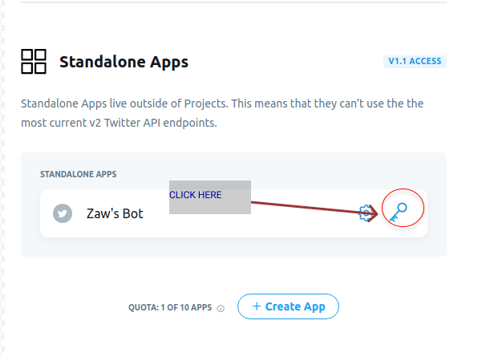

# To creat your own bot read this docs

## First You need a twitter developer account

To create developer account go this [link](https://developer.twitter.com/en/) and then you need to submit the form to get approve follow link this method read this [link](https://www.wppocket.com/apply-for-a-twitter-developer-account/) and get approved go to second.

## Second step

Go to this [link](https://developer.twitter.com/en/portal/projects-and-apps) and creat twitter app show below like this


And then You need to generate those put it on fourth step



### Create .env file

<p> copy  keys from developer account that shown in above on image and paste it each </p>

```

consumer_key=your_keys
consumer_secret=your_cosumeer_securet
access_token=your_access_token
access_token_secret=your_access_token_secret


```

## Install packages

```
       npm install

```

# Run locally

```
  npm run twitter_dev

```

# Code Explaination

```

    let Twit = require("twit");

  //Create an Instance of Twitter API and Authenticate using App Keys
let T = new Twit(require("./config"));

// search specific hastage and you can change hastage and try another
let searchHastage = { q: '#WhatsHappeningInMyanmar', count: 1, result_type: 'recent' };
function retweet() {


   //this below line is use for searching hastage and save in data variable
   T.get("search/tweets", searchHastage, (err, data) => {
       if (err) {
           console.log('Cannot Grab ', searchHastage.q);
           return;
       }
       // below if check it is available or not hastage with this
       if (data && data.statuses.length > 0) {
           let tweet = data.statuses[0];

           console.log(tweet);
           //retweet

           T.post('statuses/retweet/:id', { id: tweet.id_str }, function (err, data, response) {
               console.log(data);

               console.log("Retweet successful");
               });

           }
       else {
           console.log('No tweet on the Hastage', searchHastage.q);
       }
   });
  }
   //function recall
   retweet();
    // to set time interval for retweet new after every 1000s
   setInterval(retweet,1000 *1000)

```

<small>Follow me on twitter👉👉<a href="https://twitter.com/hareom284">@hareom284</a></small>
